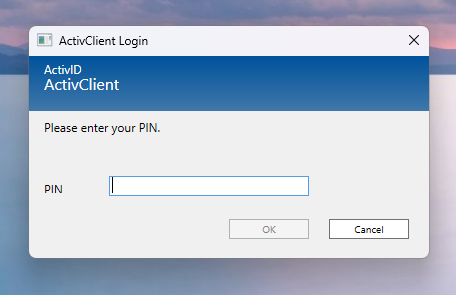

# PinSpoof

Displays a pin prompt to steal a user's pin on computers with smart card authentication. Designed to mimic HID ActivID ActivClient pin prompt which periodically displays the pin prompt to maintain session authentication. Users generally just blindly trust this and enter their pin when prompted, so the spoofed version would be nothing out of the ordinary. Currently just logs an entered pin locally but can be modified to communicate with C2 server or integrate with another credential stealing tool like mimikatz.

**For educational purposes only**
